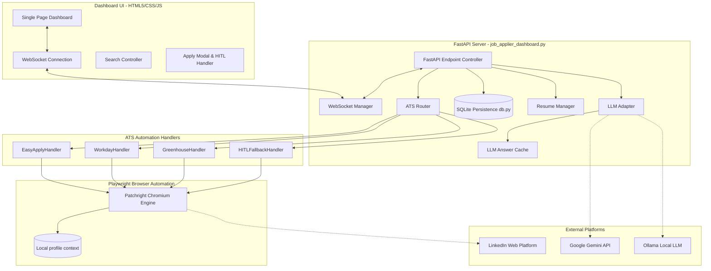
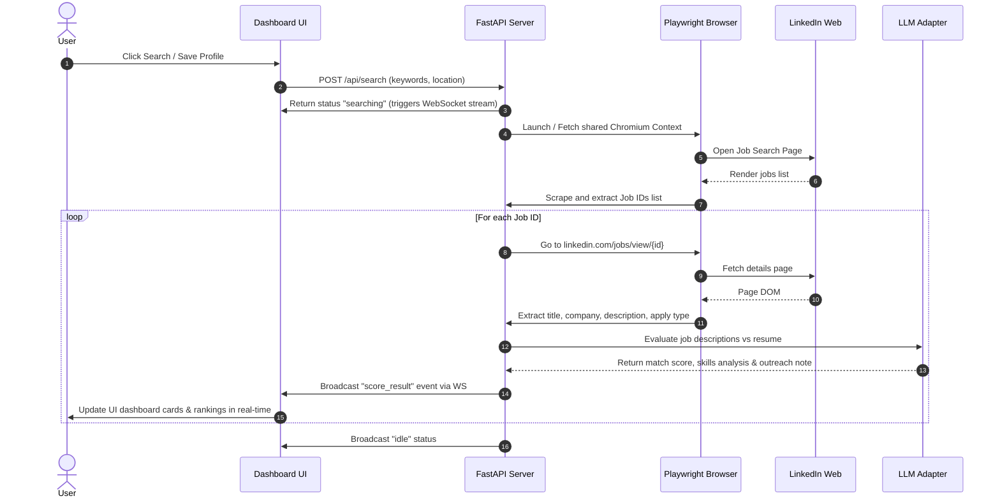
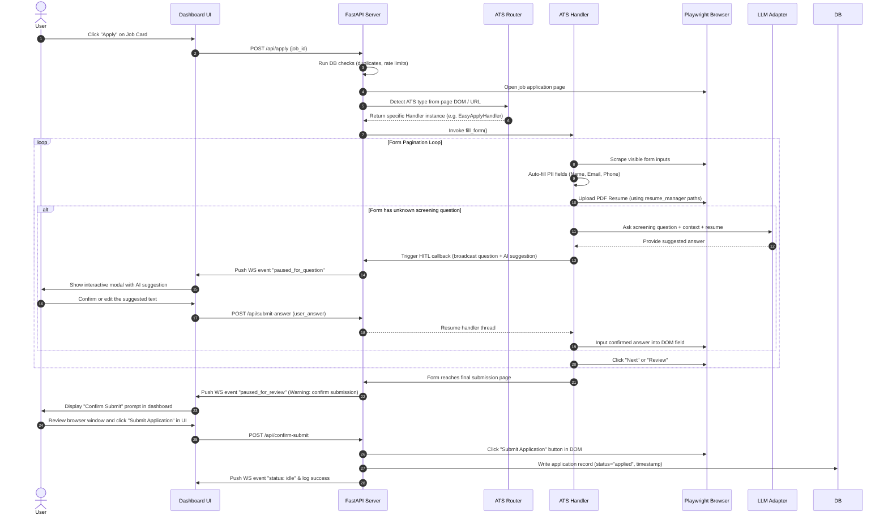

# Apply-Nav 🧭 System Architecture & Design

Apply-Nav is an AI-powered, semi-automated job application dashboard for LinkedIn. Designed around a **Human-in-the-Loop (HITL)** philosophy, it prioritizes account security, rate limits, and application accuracy over raw speed. 

This document details the system architecture, component layout, data flows, and design decisions of the codebase to help engineers understand, extend, or integration-test the project.

---

## 📌 System Architecture Overview

The system is organized into a client-server model containing a FastAPI backend, a responsive Vanilla CSS/JS frontend, a persistent SQLite database, and an browser automation layer managed by Playwright/Patchright sharing the user's authenticated LinkedIn profile.



---

## 📂 Codebase Structure & Core Modules

The codebase is organized as follows:

```text
apply-nav/
├── templates/
│   ├── index.html                  # Single Page Dashboard UI
│   ├── css/
│   │   ├── styles.css              # Typography & CSS Layout tokens (glassmorphism/dark mode)
│   │   └── components.css          # Form inputs, terminal overlay, modal layout styles
│   └── js/
│       ├── websocket.js            # Real-time backend log streaming & status sync
│       ├── search.js               # Job query management & listing renders
│       ├── apply.js                # Form fields automation visualizer & HITL prompt modal
│       ├── resume.js               # Resume drag-and-drop & status checker
│       ├── config.js               # User profiles configurations synchronizer
│       └── history.js              # SQLite-backed history explorer & statistics
├── ats_handlers/
│   ├── base.py                     # Abstract Base ATS Handler class
│   ├── easy_apply.py               # LinkedIn Easy Apply multi-page fill handler
│   ├── workday.py                  # Workday custom shadow DOM forms handling
│   ├── greenhouse.py               # Greenhouse structured standard form filler
│   └── hitl_fallback.py            # Custom field mapping suggestions & fallback
├── job_applier_dashboard.py        # Central FastAPI application server & background workers
├── db.py                           # SQLite layer for history, duplicate checks & rate-limits
├── resume_manager.py               # Extraction of PDF texts & path synchronization
├── llm_adapter.py                  # AI integrations wrapper (Gemini, Ollama, Keyword Heuristics)
├── answer_cache.py                 # Persistent cache mapping to prevent duplicate screening queries
├── ats_router.py                   # External URL pattern mapping & dispatch router
├── config.yaml                     # Initial configuration template
├── config.local.yaml               # Git-ignored local configuration containing PII and API keys
├── run_dashboard.bat               # Windows execution bootstrapper
└── run_dashboard.sh                # Linux/macOS execution bootstrapper
```

---

## ⚙️ Backend Module Breakdown

### 1. Central FastAPI Server (`job_applier_dashboard.py`)
Acts as the central orchestration hub. It executes the following responsibilities:
- **HTTP Routing:** Manages REST endpoints for configuration, search profiles, resume parsing, history lists, and session health.
- **WebSocket Gateway:** Broadcasters push real-time terminal messages, execution status logs, and screening question events directly to the UI.
- **Unified Browser Management:** Implements `get_shared_session()` which launches a single persistent chromium browser context using the LinkedIn MCP Server user data folder. It manages lock states (`_session_lock`) and handles redirects.

### 2. State & Persistence Database (`db.py`)
Encapsulates all SQLite interactions. The database contains two main tables:
- `applications`: Stores `job_id`, `title`, `company`, `location`, `ats_type`, `status` (`applied`, `failed`, `pending`, `review`), `score`, matching metrics, and execution metadata.
- `searches`: Logs historical search terms, target locations, and output metrics for dashboard stats.
- **Key Safety Heuristics:**
  - **Deduplication:** Prevents launching applications if already completed or in-progress.
  - **Rate Limiting:** Queries applications within the last hour and day to enforce safety caps (defaults: 5 per hour, 25 per day).

### 3. Multi-Provider LLM Integration (`llm_adapter.py`)
Abstracts model interaction for three critical operations:
- **Resume Scoring:** Generates match percentages (0-100), lists matching skills/skill gaps, and crafts a customized hiring manager outreach note.
- **Screening Question Answering:** Uses resume summaries and metadata to generate concise answers for custom questions.
- **Form Field Mapping:** Maps unstructured form fields (label-to-ID dictionaries) to candidate profile parameters.
- **Fallback Engine:** If no API key is defined, the system automatically falls back to a regex-based keyword-matching heuristic.

### 4. LLM Answer Cache (`answer_cache.py`)
- Standardizes and persists responses to screening questions inside `data/answer_cache.json`.
- Drastically cuts API latency and cost by avoiding redundant LLM queries for standard questions (e.g., "How many years of experience do you have with Python?").

### 5. ATS Router (`ats_router.py`) & Handlers (`ats_handlers/`)
Decouples ATS-specific automation routines via an abstract base class pattern.
- **ATS Router:** Checks external job apply URLs against registered Regex patterns (`workday`, `greenhouse`, `lever`, `icims`, `taleo`, `smartrecruiters`, `bamboohr`).
- **Base ATS Handler (`base.py`):** Defines the standard interface:
  - `can_handle(page)`: Probes the DOM structure to confirm compatibility.
  - `fill_form(...)`: Automates form elements, uploads resumes, and returns an `ApplyResult`.
- **EasyApplyHandler (`easy_apply.py`):** Runs the multi-page LinkedIn Easy Apply flow. Automatically handles PII fields, manages PDF uploads, detects non-standard questions, and pauses on final pages for manual review.
- **WorkdayHandler (`workday.py`):** Traverses Workday portals by navigating shadow DOM elements, handling sign-in walls, and auto-filling resume uploads.
- **GreenhouseHandler (`greenhouse.py`):** Detects standard Greenhouse form IDs and matching selectors for rapid automation.
- **HITLFallbackHandler (`hitl_fallback.py`):** Serves as a generic fallback. Gathers all visible inputs, applies AI mappings to guess field matches, and prompts the user in real-time.

---

## 🔄 Sequence Flows

### 1. Job Searching, Extraction & AI Scoring Flow



### 2. Form Automation & Human-in-the-Loop Workflow



---

## 🛡️ Robustness, Security & Anti-Bot Safeguards

To prevent LinkedIn from flagging automated browser interactions, the application integrates multiple layers of safety:

1. **Patchright Chromium Integration:** Built on Patchright (a modified Playwright distribution) that patches internal `navigator.webdriver` variables to bypass bot detection.
2. **Persistent Session Directory:** Operates out of `~/.linkedin-mcp/profile` which shares the standard login profile. The user logs in *once* manually, and subsequent automated requests use valid session cookies.
3. **Session Health Circuit Breaker:**
   - Tracks consecutive navigation failures or login redirects during automated runs.
   - If the system encounters `3` consecutive failures, the circuit breaker opens for **5 minutes**.
   - Prevents accounts from repeatedly hitting LinkedIn servers with broken session profiles.
4. **Human-in-the-Loop Guards:**
   - Standard forms will **never** click the final "Submit Application" button autonomously.
   - The automation pauses, updates the state to `review`, and requires the user to click the final confirm button in the dashboard or the browser.
5. **Human Interaction Simulation:**
   - Automations use randomized delays (`random.uniform(1.5, 3.0)`) before clicking buttons or inputs.
   - Typing is handled via locator actions that simulate standard text entries.

---

## 🔧 Setup & Configuration Design

The system implements a dual-configuration approach:
- **`config.yaml`:** Serves as the version-controlled structure template containing default values, model preferences, and search parameters.
- **`config.local.yaml`:** Built locally upon execution (git-ignored). Stores private information (PII) like name, telephone, email, and Gemini API keys.
- Configuration fields are accessible dynamically via the settings dashboard and are synchronized instantly back to `config.local.yaml` via the `/api/config` POST endpoint.
