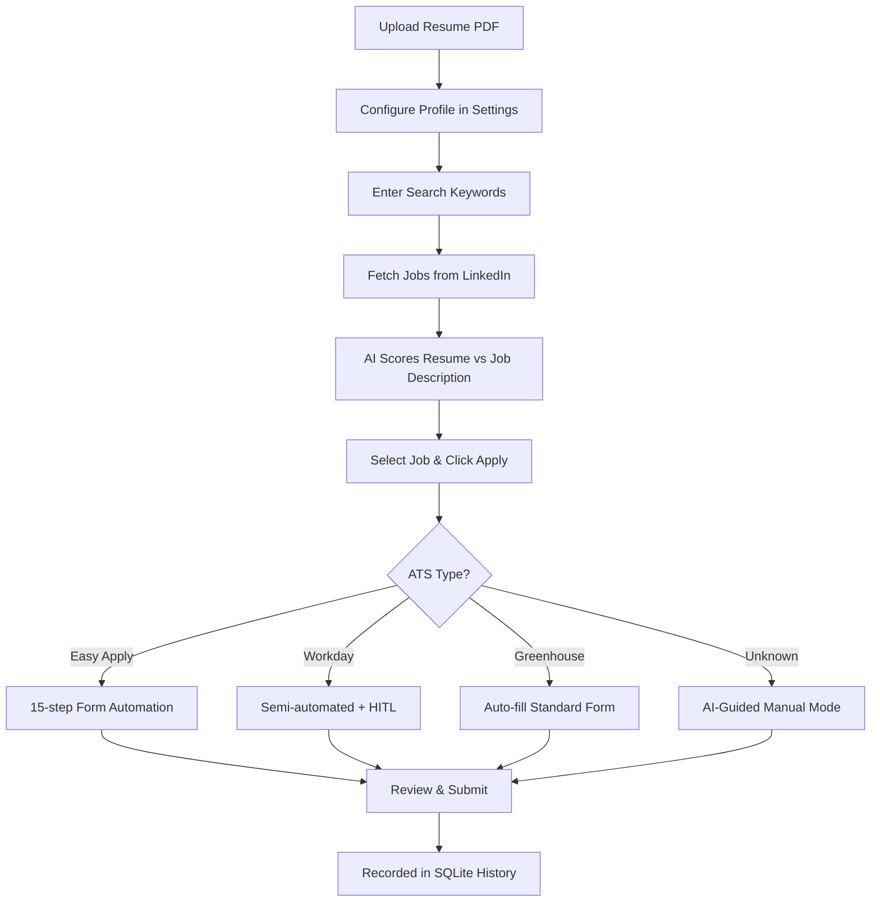

# Apply-Nav 🧭
### AI-Powered Job Application Dashboard

Apply-Nav is a locally-run, semi-automated job application tool for LinkedIn. It searches for jobs, scores them against your resume using AI, and automates the Easy Apply flow — while keeping you in full control through a **Human-in-the-Loop (HITL)** architecture.

Supports LinkedIn Easy Apply, Workday, Greenhouse, Lever, and other ATS portals with semi-automated form filling.

---

## ✨ Key Features

- **🎨 Premium Dashboard UI** — Dark mode glassmorphism interface with real-time streaming logs, match analytics, and application history tracking.
- **🧠 AI-Powered Job Matching** — Scores jobs against your resume (0-100) using Gemini or Ollama (local). Highlights matching skills, skill gaps, and generates personalized outreach notes.
- **⚡ LLM Answer Cache** — Screening question answers are normalized and cached locally (`data/answer_cache.json`) to prevent redundant LLM calls, minimizing latency and API costs.
- **🤖 Multi-ATS Automation** — Handles LinkedIn Easy Apply, Workday, Greenhouse, and unknown ATS portals. Auto-fills forms, uploads resume, pauses for HITL on complex fields.
- **🛡️ Account Safety & Circuit Breaker** — Multi-level protection with hourly/daily rate limits and a session health circuit breaker that trips after 3 failures for a 5-minute safety cooldown.
- **⚙️ Saved Search Profiles** — Save and trigger custom search configurations (keywords, locations, search depths) directly from the dashboard sidebar.
- **📊 Application History** — SQLite-backed tracking of every application with stats, dedup prevention, and searchable history.
- **📄 Resume Management** — Upload PDF via drag-and-drop, automatic text extraction for AI scoring.
- **🔧 Zero Hardcoded PII** — All personal data lives in `config.local.yaml` (gitignored). Anyone can fork and use this tool.


---

## 📂 Project Structure

```text
apply-nav/
├── templates/
│   ├── index.html                  # Main UI (~220 lines, modular)
│   ├── css/
│   │   ├── styles.css              # Core design system
│   │   └── components.css          # Component-specific styles
│   └── js/
│       ├── websocket.js            # WebSocket connection manager
│       ├── search.js               # Job search & display
│       ├── apply.js                # Apply modal & HITL flow
│       ├── resume.js               # Resume upload
│       ├── config.js               # User profile management
│       └── history.js              # Application history table
├── ats_handlers/
│   ├── base.py                     # Abstract ATS handler
│   ├── easy_apply.py               # LinkedIn Easy Apply handler
│   ├── workday.py                  # Workday semi-automation
│   ├── greenhouse.py               # Greenhouse automation
│   └── hitl_fallback.py            # Generic HITL fallback
├── job_applier_dashboard.py        # FastAPI backend server
├── db.py                           # SQLite state persistence
├── resume_manager.py               # PDF upload & text extraction
├── llm_adapter.py                  # Multi-provider LLM abstraction
├── ats_router.py                   # ATS type detection & routing
├── config.yaml                     # Configuration template (committed)
├── config.local.yaml               # Your config with secrets (gitignored)
├── run_dashboard.bat               # Windows startup script
├── run_dashboard.sh                # Linux/macOS startup script
├── LICENSE                         # MIT License
└── README.md
```

---

## 🚀 Getting Started

### Prerequisites
- **Python 3.10+**
- **uv** (recommended) or pip
- A LinkedIn account with an active session

### 1. Clone and Configure

```bash
git clone https://github.com/Saifulhuq01/linkedin-apply-nav.git
cd linkedin-apply-nav

# Create your local config
cp config.yaml config.local.yaml
```

Edit `config.local.yaml` with your details, **or** use the Settings tab in the UI after launching.

### 2. Authenticate with LinkedIn

```bash
# First-time only: log in to LinkedIn to create the browser profile.
# (Make sure to run the dashboard once first to build the virtual environment)

# Option A: Using uv (Recommended, fast & cross-platform)
cd linkedin-mcp-server
uv run -m linkedin_mcp_server --login
cd ..

# Option B: Using the created virtual environment python
# Windows:
.\linkedin-mcp-server\.venv\Scripts\python.exe -m linkedin_mcp_server --login
# Linux/macOS:
./linkedin-mcp-server/.venv/bin/python -m linkedin_mcp_server --login
```

This opens a browser. Log in to LinkedIn, then close it. Session cookies are stored locally.

### 3. Run the Dashboard

**Windows:**
```powershell
.\run_dashboard.bat
```

**Linux/macOS:**
```bash
chmod +x run_dashboard.sh
./run_dashboard.sh
```

The dashboard opens at `http://localhost:8000`.

---

## 🛠️ How It Works



### AI Scoring

With a Gemini API key (free tier available), the system:
1. Reads your extracted resume text
2. Analyzes job descriptions for skill requirements
3. Calculates a match score (0-100) with detailed rationale
4. Highlights matched skills and gaps
5. Generates personalized outreach messages

Without an API key, a keyword heuristic provides basic matching.

---

## ⚙️ Configuration

All configuration lives in `config.local.yaml` (gitignored):

| Section | Key | Description |
|---|---|---|
| `user` | `first_name`, `last_name`, `email`, `phone`, `city` | Auto-fill data for applications |
| `llm.provider` | `gemini` or `ollama` | AI provider selection |
| `llm.gemini.api_key` | Your Gemini API key | Or set `GEMINI_API_KEY` env var |
| `safety.max_applies_per_hour` | Default: 5 | Rate limiting |
| `safety.max_applies_per_day` | Default: 25 | Daily cap |

---

## 🔒 Security & Privacy

- **100% Local** — All data stays on your machine. No external servers except the chosen LLM API.
- **No PII in Source** — All personal data is in `config.local.yaml` (gitignored).
- **Rate Limiting** — Configurable hourly/daily caps prevent LinkedIn account flags.
- **HITL Safety** — Never submits without explicit user confirmation.
- **Ollama Support** — Use a local LLM for zero data leaving your machine.

---

## 🤝 Contributing

1. Fork the repository
2. Create a feature branch (`git checkout -b feature/my-feature`)
3. Make your changes
4. Submit a pull request

The codebase is modular — each ATS handler, JS module, and CSS file is independent.

---

## 📄 License

This project is licensed under the **MIT License**. See [LICENSE](./LICENSE) for details.
