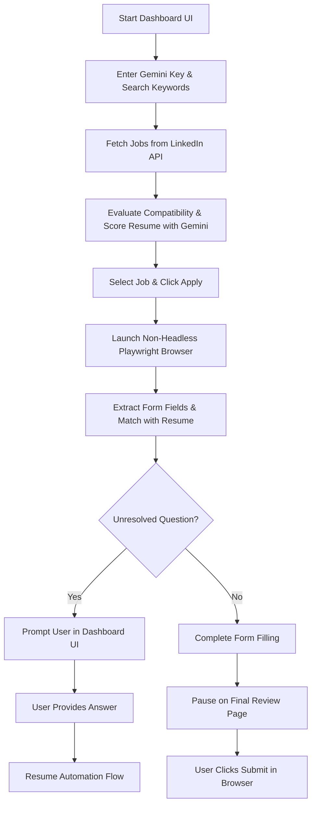

# Apply-Nav 🧭
### LinkedIn Easy Apply Automation Dashboard

Apply-Nav is a premium, locally run, semi-automated LinkedIn "Easy Apply" job application tool. Designed with security, control, and visual excellence in mind, Apply-Nav helps you search, score, and apply to jobs while keeping you completely in the driver's seat through a **Human-in-the-Loop (HITL)** architecture and smart LLM integrations.

---

## ✨ Key Features

- **🎨 Modern Aesthetic Dashboard**: Features a responsive dark mode UI with glassmorphism, tailored HSL color schemes, interactive grids, and smooth animations.
- **🧠 LLM-Powered Job Matching**: Uses the Gemini API to analyze LinkedIn job descriptions against your resume, calculate compatibility scores (0-100), highlight matching factors, and flag skill gaps.
- **🤖 Semi-Automated Playwright/Patchright Flow**: Automatically navigates to LinkedIn job pages, launches a browser, clicks the Easy Apply flow, uploads your resume, and fills in text inputs, radio selections, and checkboxes.
- **🛡️ Human-in-the-Loop Protection**: To protect your LinkedIn account from flags and blockages, the automation uses randomized typing delays. It **never** submits applications without your explicit review. It pauses on screening questions it can't resolve, letting you answer directly via the UI dashboard.
- **⚡ Unified Browser Context**: Employs a shared, persistent browser profile session across search and apply tasks to eliminate race conditions and avoid session blockages.

---

## 📂 Project Structure

```text
automation/
├── templates/
│   └── index.html               # Premium HTML5/CSS3/JS Web UI Dashboard
├── job_applier_dashboard.py     # FastAPI Server managing Playwright sessions & Gemini scoring
├── run_dashboard.bat            # Quick startup script to install dependencies and run dashboard
├── setup_git_keys.py            # Local Git configuration & SSH/GPG key generator script
├── Mohammed_Saifulhuq_Resume.pdf# Main resume file (PDF)
├── Mohammed_Saifulhuq_Resume.txt# Extracted plaintext resume for LLM parsing
├── LICENSE                      # MIT Open Source License
├── README.md                    # Project Documentation
└── .gitignore                   # Ignores venvs, cache directories, screenshots, and logs
```

---

## 🚀 Getting Started

### 1. Prerequisites
- **Python**: Version 3.10 or higher.
- **uv**: It is recommended to use `uv` (a fast Python package installer and manager). You can install it via:
  ```powershell
  powershell -ExecutionPolicy ByPass -c "irm https://astral.sh/uv/install.ps1 | iex"
  ```
- **Git**: Installed at `C:\Program Files\Git` (needed for repository tracking).
- **GnuPG (GPG)**: Installed with Git (needed for signed commits).

### 2. Initializing Git & Key Configurations
To secure your repository commits and prepare for open-sourcing, we have configured your Git credentials, generated SSH keys, and set up GPG commit signing:
- **Git Username**: `saifulhuq01`
- **Git Email**: `s.md.saifulhuq007@gmail.com`

You can run the script manually if you ever need to re-generate or view your keys again:
```powershell
.\linkedin-mcp-server\.venv\Scripts\python.exe setup_git_keys.py
```

#### 🔑 Adding Keys to your GitHub Account
1. **SSH Key**: Copy the public key printed by the setup script (located at `C:\Users\smdsa\.ssh\id_ed25519.pub`). Go to **GitHub Settings ➔ SSH and GPG keys ➔ New SSH Key** and paste it there.
2. **GPG Key**: Copy the block starting with `-----BEGIN PGP PUBLIC KEY BLOCK-----` (which can also be retrieved by running `gpg --armor --export s.md.saifulhuq007@gmail.com`). Go to **GitHub Settings ➔ SSH and GPG keys ➔ New GPG Key** and paste it.

### 3. First-Time LinkedIn Session Login
Before running the automated dashboard, you must establish an authenticated session in the automated browser profile so the crawler doesn't get blocked:
```powershell
.\linkedin-mcp-server\.venv\Scripts\python.exe -m linkedin_mcp_server --login
```
This opens a browser window. Log into your LinkedIn account. Once logged in, you can close the browser window. The session cookies will be stored securely in `~/.linkedin-mcp/profile`.

### 4. Running the Dashboard
Simply double-click the `run_dashboard.bat` file or execute it in your terminal:
```powershell
.\run_dashboard.bat
```
This script will:
1. Verify and install FastAPI, Uvicorn, Websockets, and Google-GenAI.
2. Launch the backend application.
3. Automatically open your browser to `http://localhost:8000`.

---

## 🛠️ How it Works



### 🧠 Gemini Scoring System
By providing a Gemini API Key in the top panel, the server leverages Gemini's capabilities to:
1. Read the parsed plaintext file (`Mohammed_Saifulhuq_Resume.txt`).
2. Analyze the job description for technical stack requirements, domain overlap, and experience levels.
3. Generate a matching breakdown and calculate a matching score out of 100.
4. Auto-generate custom outreach messages that align your profile directly to the specific job duties.

---

## 🔒 Security & Safe Usage

- **Rate Limiting**: To prevent LinkedIn from flagging automated actions, the backend executes actions with randomised pauses (between 1 and 3.5 seconds) simulating human interaction speed.
- **Local Credentials**: Resume paths, session profiles, and API keys are stored and run entirely on your local machine. No data is transmitted to external servers except to the Gemini API for scoring.
- **Safety Pauses**: The Playwright script is configured to pause at the final submission stage. This allows you to verify that all auto-filled information is correct before submitting the application.

---

## 📄 License

This project is licensed under the MIT License. See the [LICENSE](file:///c:/Users/smdsa/Desktop/automation/LICENSE) file for more details.
